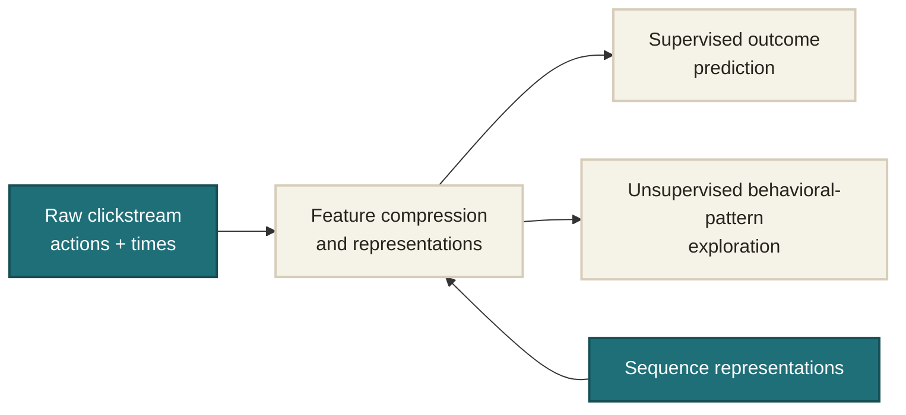
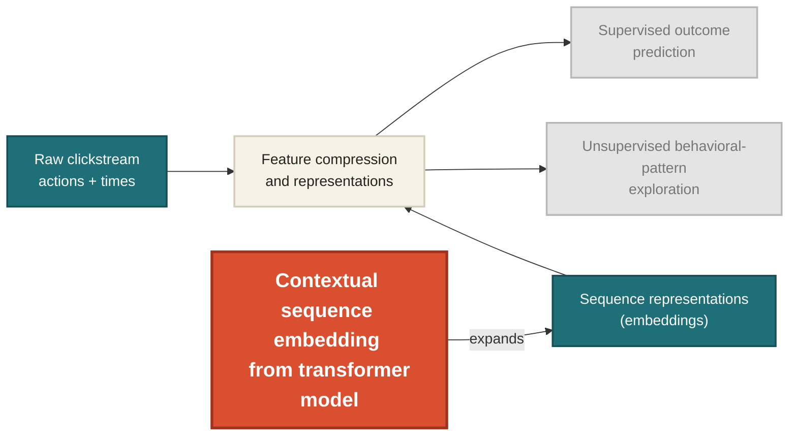
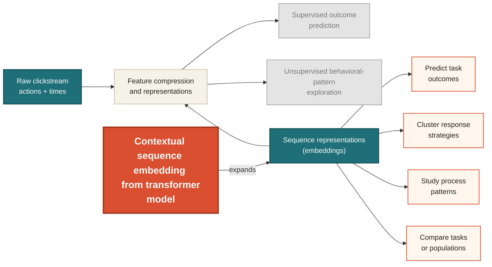

{width=88%}

::right::

<v-clicks depth="1" class="text-sm leading-5">

- **Supervised outcome prediction**  
  Use process data to predict accuracy, completion efficiency, or other external outcomes.
  *Examples: [Chen et al. (2019)](https://doi.org/10.3389/fpsyg.2019.00486); [Chen, Lu, & Cui (2024)](https://doi.org/10.1007/s10639-023-12389-x).*

- **Unsupervised behavioral-pattern exploration**  
  Uncovering recurring states, test taking strategies, or response patterns within the process data.
  *Examples: [Ulitzsch, He, & Pohl (2022)](https://doi.org/10.3102/10769986211010467); [He, Borgonovi, & Paccagnella (2021)](https://doi.org/10.1016/j.compedu.2021.104170).*

</v-clicks>

| student_id | seq_len | event_sequence |
|---|---:|---|
| S001 | 5 | `Q1:view@0, Q1:answer@12, Q2:view@15, Q3:view@41, Q3:submit@45` |
| S002 | 11 | `Q1:view@0, Q2:view@3, Q1:view@9, Q1:view@9, ... Q4:submit@140` |
| S003 | 3 | `Q1:view@0, Q1:idle@300, Q1:submit@301` |
| ... | ...| `Q1:view@0, null@2` |

---

# Three Broad Strategies for Representing Clickstreams

Conventional statistical analyses generally require each respondent to have the same set of dimensions.

1. **Engineered summary features**  
   Summarize time, action counts, transitions, n-grams, or task-specific behaviors.

2. **Sequence similarity using distance matrix**  
   Compare whole sequences using edit distance, longest common subsequence, or optimal matching; analyze the resulting distances directly or through MDS.

3. **Learned sequence representations from sequence models**  
   Use autoencoders, RNNs, or LSTMs to learn fixed-dimensional embeddings.

> 
>   The gap:
>   using a learned model does not automatically solve the representation problem. The remaining challenge is to learn embeddings that preserve contextual information from the full sequence while also being reusable across different analytic goals.
> 

---
layout: center
---

# Where This Study Sits

<v-switch>
<template #1>

</template>
<template #2>

</template>
<template #3>

</template>
</v-switch>

---
layout: two-cols-header
layoutClass: gap-12
class: "text-[0.7em] leading-snug [&_h2]:!mb-2 [&_h2]:!text-[1.65em] [&_h3]:!mb-1 [&_h3]:!text-[1.15em] [&_li]:!my-1"
---

  <h1 class="!m-0">Why Transformer?</h1>
  <v-click>
    

    Attention is all you need!
    (Vaswani et al., 2017)

  </v-click>

::left::

<v-click>

## RNNs and LSTMs

### Recurrent mechanism

- Process actions one at a time
- Update a hidden state that carries the previous history:

$$h_t=f(x_t,h_{t-1})$$

### Limitations for long clickstreams

- Distant evidence must pass through many recurrent updates
- One evolving hidden state can become an information bottleneck
- LSTM gates reduce but do not remove these challenges

</v-click>

::right::

<v-click>

## Self-attention

### Attention mechanism

1. Each action can directly evaluate which earlier actions are relevant
2. The model creates **query**, **key**, and **value** vectors for each token/action.
3. Query–key similarity determines the attention weights (which earlier actions matter):

$$\alpha_{ij}=\operatorname{softmax}\left(\frac{q_i k_j^\top}{\sqrt d}\right)$$

3. Their values are combined into a contextual representation:

$$z_i=\sum_{j\leq i}\alpha_{ij}v_j$$

</v-click>
