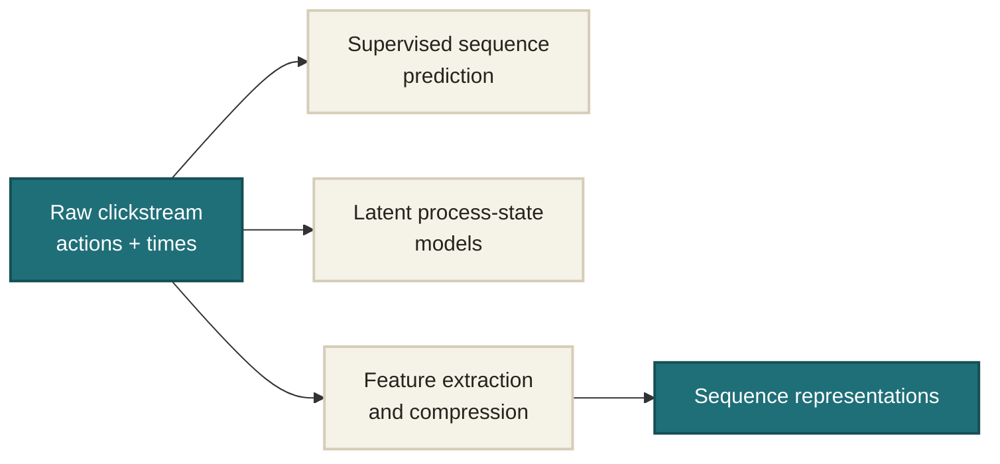
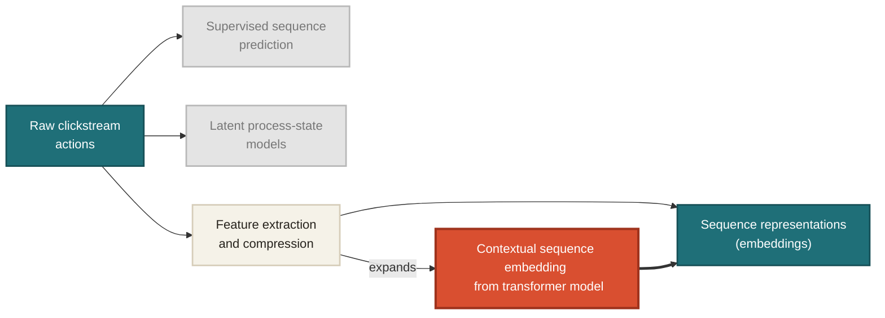
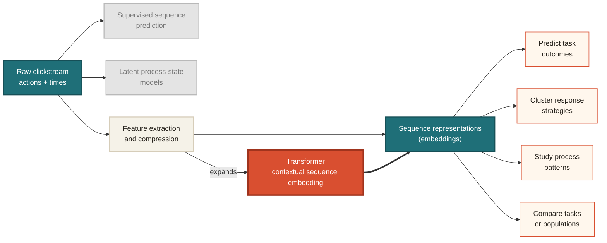
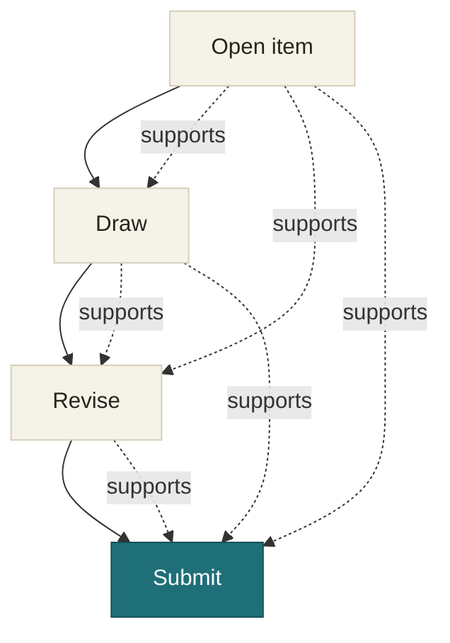

{width=88%}

::right::

<v-clicks depth="1" class="text-sm leading-5">

- **Supervised outcome prediction**  
  Use process data to predict accuracy, scores, completion, or other external outcomes.
  *Examples: [Chen et al. (2019)](https://doi.org/10.3389/fpsyg.2019.00486); [Chen, Lu, & Cui (2024)](https://doi.org/10.1007/s10639-023-12389-x).*

- **Unsupervised behavioral-pattern exploration**  
  Uncovering recurring states, test taking strategies, or response patterns within the process data.
  *Examples: [Ulitzsch, He, & Pohl (2022)](https://doi.org/10.3102/10769986211010467); [He, Borgonovi, & Paccagnella (2021)](https://doi.org/10.1016/j.compedu.2021.104170).*

</v-clicks>

| student_id | seq_len | event_sequence |
|---|---:|---|
| S001 | 5 | `Q1:view@0, Q1:answer@12, Q2:view@15, Q3:view@41, Q3:submit@45` |
| S002 | 11 | `Q1:view@0, Q2:view@3, Q1:view@9, Q1:view@9, ... Q4:submit@140` |
| S003 | 3 | `Q1:view@0, Q1:idle@300, Q1:submit@301` |
| ... | ...| `Q1:view@0, null@2` |

---

# Four Broad Strategies for Representing Clickstreams

Conventional statistical analyses generally require each respondent to have the same set of dimensions.

1. **Engineered features**  
   Summarize time, action counts, transitions, n-grams, or task-specific behaviors.

2. **Sequence similarity or distance**  
   Compare whole sequences using edit distance, longest common subsequence, or optimal matching; analyze the resulting distances directly or through MDS.

3. **Latent process representations**  
   Describe behavior using a bounded set of latent states, classes, or transition parameters.

4. **Learned sequence representations**  
   Use autoencoders, RNNs, or transformers to learn fixed-dimensional embeddings.

> **The gap is not a lack of ways to reduce the data. The challenge is learning representations that preserve contextual detail while remaining reusable across analytic goals.**

---
layout: center
---

# Where This Study Sits

<v-switch>
<template #1>

</template>
<template #2>

</template>
<template #3>

</template>
</v-switch>

---
layout: two-cols
layoutClass: gap-16
---

# Why Using a Transformer?

- **Sequential context**
  - Masked self-attention lets each action condition on previous actions

- **Flexible positions**
  - Action, position, and time features can be embedded together before the transformer layers

- **Reusable embeddings**
  - The final sequence representation can support prediction, clustering, and interpretation

::right::

