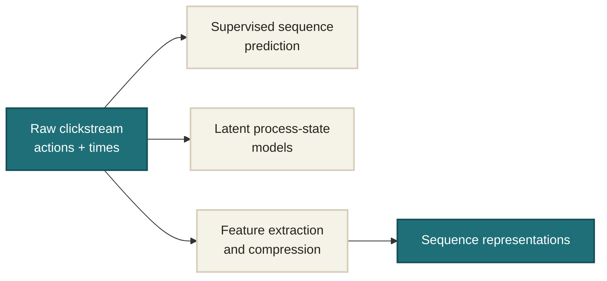
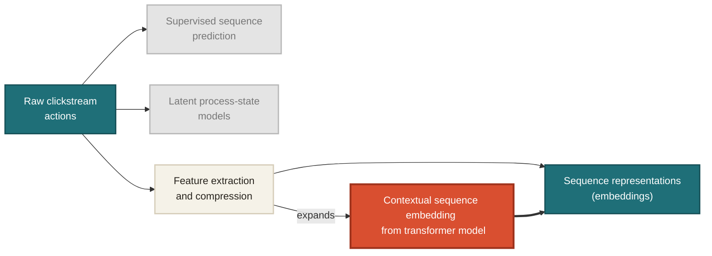
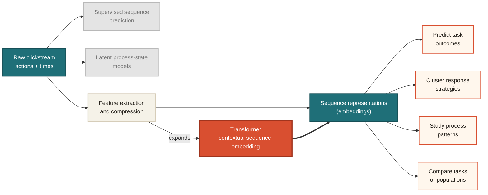
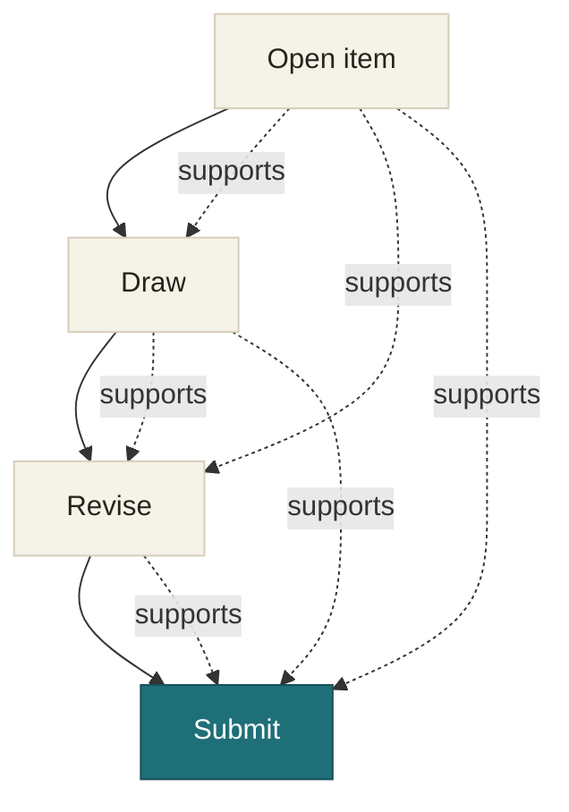

# Existing Approaches

<v-clicks depth="2">

1. **Supervised sequence prediction**
   - Learn sequence representations optimized for predicting task outcomes.
   - Examples: RNNs, LSTMs, GRUs over action and time sequences.

2. **Latent process-state models**
   - Represent clickstream behavior as transitions among discrete latent states.
   - Examples: HMMs, latent transition models, sequence-oriented latent classes.

3. **Feature extraction and sequence compression**
   - Convert irregular clickstreams into fixed-dimensional summaries.
   - Examples: handcrafted process features, OSS/MDS features, RNN autoencoders.

</v-clicks>

---

# The Gap

<v-clicks>

- Clickstream sequences are irregular, high-dimensional, and context dependent.
- Existing methods often summarize behavior into discrete states, handcrafted features, or prediction-targeted representations.
- These approaches can lose sequence-wide contextual information.
- We need a representation-learning approach that preserves action-level context while producing scalable respondent-level embeddings.

</v-clicks>

---
layout: center
---

# Where This Study Sits

<v-switch>
<template #1>

</template>
<template #2>

</template>
<template #3>

</template>
</v-switch>

---
layout: two-cols
layoutClass: gap-16
---

# Why Using a Transformer?

- **Sequential context**
  - Masked self-attention lets each action condition on previous actions

- **Flexible positions**
  - Action, position, and time features can be embedded together before the transformer layers

- **Reusable embeddings**
  - The final sequence representation can support prediction, clustering, and interpretation

::right::

