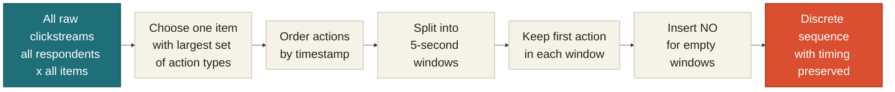
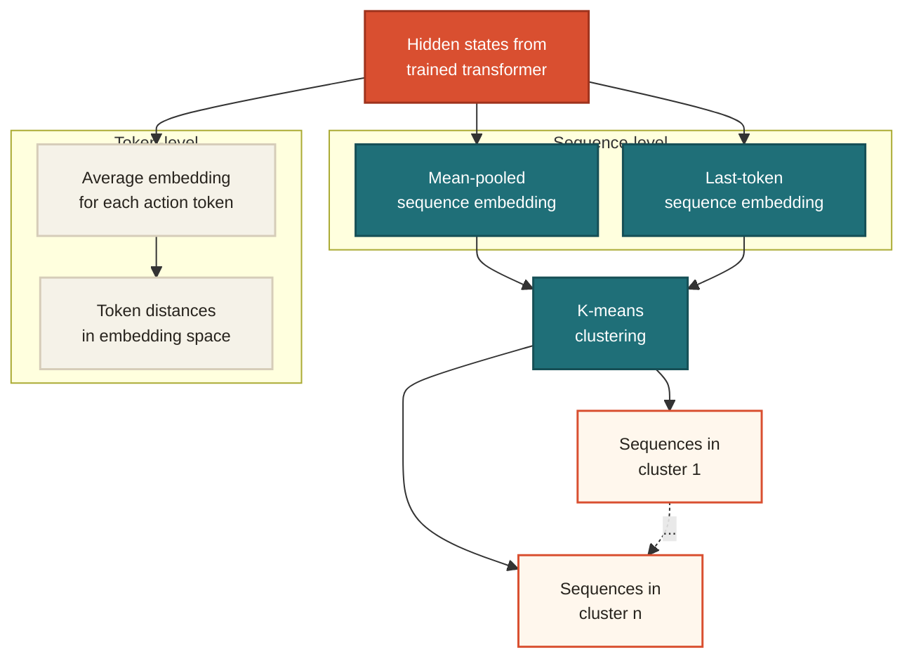

# Method
Before training, Model architecture, Embedding exploration 

---
layout: two-cols
layoutClass: gap-14
---

<h1 class="text-3xl leading-tight">Before Training: Data Processing</h1>

<v-clicks>

- Raw clickstream data are timestamped actions for each respondent.
- Each row records for each respondent, which item they were working on, when the action happened, and the observable action type.
- These raw records are irregularly spaced in time and vary in length across respondents.

</v-clicks>

::right::

<div class="mt-3 text-sm leading-6">

| Respondent | Item | Timestamp | Observable |
|---|---|---:|---|
| R001 | Item 12 | 0.8s | Enter Item |
| R001 | Item 12 | 2.1s | Receive Focus |
| R001 | Item 12 | 7.4s | Draw |
| R001 | Item 12 | 16.2s | Exit Item |
| R002 | Item 12 | 0.5s | Enter Item |
| R002 | Item 12 | 5.9s | Draw |

</div>

<div class="mt-5 text-base leading-4 text-[#1f6f78] font-semibold">
Data source: 2017 NAEP Grade ​4 and Grade 8 Mathematics Assessment Public Process Data
</div>

---
layout: default
---




<div class="mt-8 grid grid-cols-[1.1fr_1fr] gap-8 items-start">

<div class="text-sm leading-6">

| Window | Observed action | Action code |
|---:|---|---|
| 0-5s | Enter Item, Receive Focus | `ENI` |
| 5-10s | Draw | `D` |
| 10-15s |  | `NO` |
| 15-20s |  | `NO` |
| ... | ...| ... |
| 20s - $t_{last}$ | Exit Item | `EXI` |

</div>

<div class="pt-5 text-center">

<div class="flex flex-col gap-3 text-lg font-semibold text-[#1f6f78]">
  <div>`R1: ENI, D, OC, NO, EXI`</div>
  <div>`R2: ENI, SEO, D, E, NO, NO, NO, NO, CS, EXI`</div>
  <div> $R_i$: `ENI, NO, EXI` </div>
</div>

<div class="mt-6 text-left text-sm leading-6 text-[#2E294E]">

- Each action code becomes one token
- So now we have tokenized process sequences for all respondent for a single item
- How to represent those tokens in vector space using numeric values?

</div>

</div>

</div>

---
layout: default
---

<h1 class="text-2xl leading-tight">Before Training: Token Embeddings</h1>

<div class="mt-6 text-xl font-semibold text-[#1f6f78]">

Sequence: `ENI` - `D` - `OC` - `NO` - `EXI`

</div>

<div class="mt-8 grid grid-cols-[1.2fr_0.8fr] gap-10 items-start">

<div class="text-sm leading-6">

| Token | dim 1 |  dim 2 |  dim 3 | ... | dim 16 |
|---|---:|---:|---:|---:|---:|
| `ENI` | 0.12 | -0.44 | 0.31 | ... | -0.08 |
| `D` | -0.27 | 0.18 | 0.09 | ... | 0.41 |
| `OC` | 0.33 | 0.05 | -0.22 | ... | 0.16 |
| `NO` | -0.10 | -0.36 | 0.28 | ... | 0.03 |
| `EXI` | 0.07 | 0.25 | -0.14 | ... | -0.31 |

</div>

<div class="text-base leading-7 text-[#2E294E]">

- Map each action token to a numeric vector (16 dimensions in our model).
- The vector is the token's location in embedding space.
- Before training, these embedding values are randomly initialized.
- Actions that occur in similar sequence contexts may develop more similar representations.

</div>

</div>

---
layout: two-cols
layoutClass: gap-10
---

# Training: Decoder-Only Transformer 

<div class="mt-6 text-sm leading-10">

<v-clicks>

- Add `SOS` and `EOS` tokens to mark the beginning and end of each action sequence.
- Add `PAD` tokens to shorter sequences so all sequences within a batch have the same length.
- Create input and target sequences offset by one position for **next-action prediction**.
- Add positional encodings so the model can distinguish the same action token at different time steps.
- Use a causal mask so position *t* can attend only to itself and earlier actions.
- Predict each **next action token** from the preceding action tokens.
- Architecture: token embedding dimension **16**, **2** decoder layers, **4** attention heads, and feed-forward dimension **128**.
- Ignore `PAD` positions when calculating the cross-entropy loss.

</v-clicks>

</div>

::right::

<div class="mt-8 text-sm font-semibold text-[#1f6f78]">
Architecture in code
</div>

```python
layer = nn.TransformerDecoderLayer(
    d_model=16,
    nhead=4,
    dim_feedforward=128,
    batch_first=True,
)
self.decoder = nn.TransformerDecoder(
    layer,
    num_layers=2,
)
self.out = nn.Linear(16, vocab_size)
```
 

---
layout: default
---

<h1 class="text-2xl leading-tight">Training: Decoder-Only Transformer Architecture</h1>

<div class="mt-3">
  <TransformerTraining /> 
</div>

---
layout: default
---

<h1 class="text-2xl leading-tight">Trained Embedding Representations</h1>

<div class="mt-5 text-sm leading-6 text-[#1E1B18]">
After training, each respondent's token sequence can be represented by learned token vectors.
</div>

<div class="mt-5 grid grid-cols-2 gap-8 items-start">

<div>

<div class="mb-2 text-sm font-semibold text-[#1f6f78]">Example 1: longer response process</div>

<div class="mb-3 font-mono text-xs text-[#1E1B18]">
R1: `ENI` -> `D` -> `OC` -> `NO` -> `EXI`
</div>

<div class="text-xs leading-5">

| resp | Token | dim 1 | dim 2 | dim 3 | ... | dim 16 |
|---|---|---:|---:|---:|---:|---:|
| R1 | `ENI` | 0.42 | -0.18 | 0.67 | ... | -0.21 |
| R1 | `D` | -0.31 | 0.54 | 0.12 | ... | 0.38 |
| R1 | `OC` | 0.59 | 0.07 | -0.44 | ... | 0.16 |
| R1 | `NO` | -0.22 | -0.61 | 0.35 | ... | 0.04 |
| R1 | `EXI` | 0.18 | 0.29 | -0.52 | ... | -0.33 |

</div>

</div>

<div>

<div class="mb-2 text-sm font-semibold text-[#1f6f78]">Example 2: A shorter response process</div>

<div class="mb-3 font-mono text-xs text-[#1E1B18]">
R2: `ENI` -> `NO` -> `EXI`
</div>

<div class="text-xs leading-5">

| resp | Token | dim 1 | dim 2 | dim 3 | ... | dim 16 |
|---|---|---:|---:|---:|---:|---:|
| R2 | `ENI` | 0.42 | -0.18 | 0.67 | ... | -0.21 |
| R2 | `NO` | -0.22 | -0.61 | 0.35 | ... | 0.04 |
| R2 | `EXI` | 0.18 | 0.29 | -0.52 | ... | -0.33 |

</div>

</div>

</div>

---
layout: two-cols
layoutClass: gap-14
---

# Explore Embedding Representations


::left::



::right::

<div class="mt-2 text-sm font-semibold text-[#1f6f78]">
token embeddings for two sequences
</div>

<div class="mt-3 text-[0.64rem] leading-4">

| resp | pos | Token | dim 1 | dim 2 | dim 3 | ... | dim 16 |
|---|---:|---|---:|---:|---:|---:|---:|
| R1 | 1 | `ENI` | 0.42 | -0.18 | 0.67 | ... | -0.21 |
| R1 | 2 | `D` | -0.31 | 0.54 | 0.12 | ... | 0.38 |
| R1 | 3 | `OC` | 0.59 | 0.07 | -0.44 | ... | 0.16 |
| R1 | 4 | `NO` | -0.22 | -0.61 | 0.35 | ... | 0.04 |
| R1 | 5 | `EXI` | 0.18 | 0.29 | -0.52 | ... | -0.33 |
| R2 | 1 | `ENI` | 0.42 | -0.18 | 0.67 | ... | -0.21 |
| R2 | 2 | `NO` | -0.22 | -0.61 | 0.35 | ... | 0.04 |
| R2 | 3 | `EXI` | 0.18 | 0.29 | -0.52 | ... | -0.33 |

</div>

 